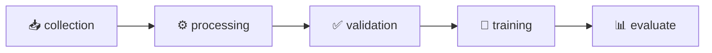

# 🏦 Credit Score Prediction - MLOps Project

<div align="center">


**Un pipeline MLOps complet pour la prédiction de score de crédit**

[🚀 Quick Start](#-quick-start) •
[📊 Pipeline](#-pipeline-dvc) •
[📈 MLflow](#-mlflow-tracking) •
[🐳 Docker](#-docker)

</div>

---

## 📋 Description

Ce projet implémente un **pipeline MLOps production-ready** pour la prédiction de score de crédit, utilisant les meilleures pratiques de l'industrie.

### ✨ Fonctionnalités

| Feature | Description |
|---------|-------------|
| 🔄 **DVC Pipeline** | Versioning des données et orchestration du pipeline |
| 📊 **MLflow Tracking** | Suivi des expériences, métriques et artefacts |
| ⚙️ **Configuration YAML** | Configuration centralisée et modulable |
| ✅ **Data Validation** | Validation automatique des données avec schémas |
| 🐳 **Docker Ready** | Containerisation complète avec docker-compose |
| 🔁 **CI/CD** | GitHub Actions pour l'intégration continue |
| 📱 **Streamlit Dashboard** | Interface web pour l'exploration des données |

## 🏗️ Architecture du Projet

```
credit_score/
│
├── 📁 src/                      # Code source principal
│   ├── config.py                # Chargement de la configuration
│   ├── logger.py                # Logging structuré
│   ├── tracking.py              # MLflow tracker utilities
│   ├── validation.py            # Validation des données
│   ├── data_collection.py       # Collecte depuis OpenML
│   ├── data_prepro.py           # Feature engineering
│   ├── train.py                 # Entraînement avec MLflow
│   ├── evaluate.py              # Évaluation et visualisations
│   └── eda_stream.py            # Dashboard Streamlit
│
├── 📁 configs/
│   └── config.yaml              # Configuration centralisée
│
├── 📁 data/
│   ├── raw/                     # Données brutes (DVC)
│   └── processed/               # Données traitées (DVC)
│
├── 📁 models/                   # Modèles entraînés
├── 📁 metrics/                  # Métriques JSON
├── 📁 plots/                    # Visualisations générées
├── 📁 logs/                     # Fichiers de log
├── 📁 mlruns/                   # MLflow tracking local
│
├── 📁 .github/workflows/        # CI/CD GitHub Actions
│
├── 🐳 Dockerfile                # Image Docker
├── 🐳 docker-compose.yaml       # Services Docker
├── 📋 dvc.yaml                  # Pipeline DVC
├── ⚙️ make.ps1                  # Commandes PowerShell (Windows)
├── 📦 requirements.txt          # Dépendances Python
└── 📖 README.md
```

## 🚀 Quick Start

### Prérequis
- Python 3.11+
- Git

### Installation

```powershell
# Cloner le repository
git clone https://github.com/kabbstat/credit_score.git
cd credit_score

# Créer un environnement virtuel
python -m venv venv
.\venv\Scripts\activate

# Installer les dépendances
.\make.ps1 install
```

### Lancer le pipeline complet

```powershell
# Exécuter tout le pipeline (collecte → traitement → validation → training → évaluation)
.\make.ps1 pipeline
```

## 📊 Dataset

Le projet utilise le dataset de credit scoring d'**OpenML** (ID: 46441).

| Propriété | Valeur |
|-----------|--------|
| 📊 Samples | 100,000 |
| 🔢 Features | 19 (après preprocessing) |
| 🎯 Target | Score de crédit (3 classes) |
| 📥 Source | OpenML Dataset #46441 |

### Features Engineered

```
debt_to_income          = outstanding_debt / annual_income
emi_to_income_ratio     = total_emi_per_month / monthly_inhand_salary
loan_to_income_ratio    = outstanding_debt / monthly_inhand_salary
delayed_payment_freq    = num_of_delayed_payment / num_of_loan
credit_efficiency       = credit_utilization_ratio * (1 - delay_from_due_date)
payment_discipline_score = 1 - (num_of_delayed_payment / (num_credit_inquiries + 1))
```

## 🔄 Pipeline DVC

Le pipeline est orchestré par DVC en **5 étapes** :



### Commandes DVC

```powershell
.\make.ps1 pipeline      # Exécuter le pipeline complet
.\make.ps1 dvc-status    # Voir le statut
.\make.ps1 dvc-dag       # Visualiser le DAG
.\make.ps1 dvc-metrics   # Afficher les métriques
```

### Description des étapes

| Étape | Script | Description |
|-------|--------|-------------|
| **collection** | `data_collection.py` | Téléchargement depuis OpenML |
| **processing** | `data_prepro.py` | Nettoyage et feature engineering |
| **validation** | `validation.py` | Validation des données avec schémas |
| **scorecard** | `scorecard.py` | Analyse WoE/IV et ranking des features |
| **resampling** | `resampling.py` | SMOTE / Undersampling (classes déséquilibrées) |
| **training** | `train.py` | Entraînement + MLflow (RF, XGBoost, LR Lasso) |
| **evaluate** | `evaluate.py` | Métriques bancaires, SHAP, rapport HTML |
| **monitoring** | `monitoring.py` | Drift detection (PSI) |

## 📈 MLflow Tracking

Le tracking des expériences est automatique lors de l'entraînement.

```powershell
# Lancer MLflow UI
.\make.ps1 mlflow
```

🌐 Accédez à **http://localhost:5000**

### Ce qui est tracké :

| Catégorie | Éléments |
|-----------|----------|
| **Parameters** | n_estimators, max_depth, min_samples_split, class_weight |
| **Metrics** | accuracy, precision, recall, f1_score, roc_auc, cv_scores |
| **Artifacts** | model.pkl, confusion_matrix.png, feature_importance.png |

## 🖥️ Commandes Disponibles

```powershell
.\make.ps1 help          # 📖 Afficher l'aide

# PIPELINE
.\make.ps1 install       # 📦 Installer les dépendances
.\make.ps1 pipeline      # 🔄 Exécuter le pipeline complet
.\make.ps1 train         # 🎯 Entraîner le modèle (avec MLflow)
.\make.ps1 evaluate      # 📊 Évaluer le modèle

# SERVICES
.\make.ps1 mlflow        # 📈 Lancer MLflow UI (port 5000)
.\make.ps1 streamlit     # 📱 Lancer Streamlit EDA (port 8501)

# DVC
.\make.ps1 dvc-status    # 📋 Statut du pipeline
.\make.ps1 dvc-dag       # 🌳 Visualiser le DAG
.\make.ps1 dvc-metrics   # 📊 Afficher les métriques
```

## 🐳 Docker

```powershell
# Construire l'image
docker build -t credit-score:latest .

# Lancer tous les services
docker-compose up -d
```

### Services disponibles

| Service | Port | Description |
|---------|------|-------------|
| **MLflow** | 5000 | UI de tracking des expériences |
| **Streamlit** | 8501 | Dashboard EDA interactif |
| **Trainer** | - | Service d'entraînement |
| **Evaluator** | - | Service d'évaluation |

## 📊 Résultats

### Dernières métriques (RandomForest — 100K samples, 3 classes)

**Métriques standard ML :**

| Métrique | Score |
|----------|-------|
| **Accuracy** | 95.36% |
| **F1-Score (macro)** | 95.09% |
| **ROC AUC (OvR)** | 99.20% |
| **Cross-Val Mean** | ~95% |

**Métriques bancaires (Scoring crédit) :**

| Métrique | Score | Seuil industrie |
|----------|-------|-----------------|
| **Gini coefficient** | **99.05%** | > 40% acceptable |
| **KS statistic** | **94.47%** | > 30% bon |
| **PSI monitoring** | rapport `metrics/monitoring_report.json` | < 10% stable |

### Artefacts générés

```
models/
└── model.pkl                 # Modèle entraîné

metrics/
├── train_metrics.json        # Métriques d'entraînement
└── metrics.json              # Métriques d'évaluation

plots/
├── confusion_matrix.png      # Matrice de confusion
└── feature_importance.png    # Importance des features
```

## 🛠️ Stack Technique

<div align="center">

| Catégorie | Technologies |
|:---------:|:-------------|
| **🤖 Machine Learning** | Scikit-learn, Pandas, NumPy, Imbalanced-learn |
| **📊 MLOps** | DVC, MLflow |
| **🌐 Web** | Streamlit |
| **🐳 Container** | Docker, Docker Compose |
| **🔁 CI/CD** | GitHub Actions |
| **📝 Config** | YAML, Dataclasses |

</div>

## 📝 Configuration

La configuration est centralisée dans `configs/config.yaml` :

```yaml
data:
  raw_path: "data/raw/data.csv"
  processed_path: "data/processed/processed.csv"

model:
  # Changer le modèle ici sans toucher au code
  name: "RandomForestClassifier"   # ou "XGBClassifier", "LogisticRegressionLasso"
  params:
    n_estimators: 500
    class_weight: "balanced"       # gestion du déséquilibre des classes

mlflow:
  experiment_name: "credit-scoring"
  tracking_uri: "mlruns"
```

### Modèles supportés

| Modèle | Usage |
|--------|-------|
| `RandomForestClassifier` | Scoring crédit (interprétabilité réglementaire) |
| `XGBClassifier` | Détection de fraude (performance sur classes déséquilibrées) |
| `LogisticRegressionLasso` | Scorecard réglementaire (Bâle II/III, conformité RGPD) |

